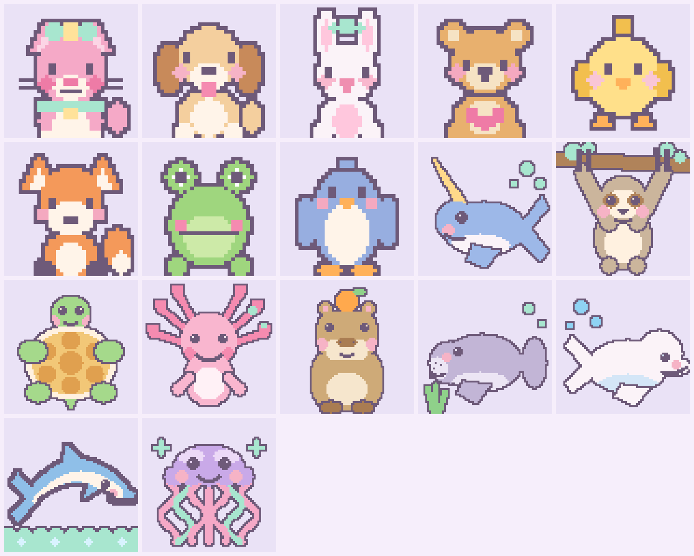

# 🎨 Paint by Numbers

A tiny, adorable **paint-by-numbers game for little artists**, made for playing on a
tablet in the browser. Pick a cute pixel character, tap a color, and fill in the
matching numbers to reveal it. Comes with **seventeen candy-pastel characters**:

- **Eight starters** at 36×36 — 🐱🐶🐰🐻🐥🦊🐸🐧 — around 600–750 squares each.
- **Nine big ones** at 72×72 — 🦄🦥🐢🩷🐹🌿🤍🐬🎐 narwhal, sloth, turtle, axolotl,
  capybara, manatee, beluga, dolphin and jellyfish — four times the pixels, about
  1,900–2,700 squares each. Pinch to zoom in on these (or tap 🔍).

Built as a gift for my daughter after one too many junky app-store games — so it's
**fully open source**, ad-free, tracker-free, and works completely offline.

**▶ Play it here:** https://maximstark.github.io/paint-by-numbers/

<p align="center">
  
</p>

## How to play

1. **Pick a picture** from the gallery.
2. Tap a **color** at the bottom. The squares that match it gently glow.
3. **Tap or drag** across those squares to paint them.
4. Fill every number to finish the picture — then enjoy the confetti! 🎉

Little touches for little hands:
- **Big, friendly pixels** and large touch targets.
- On the big 72×72 pictures, **pinch to zoom** and drag with two fingers to move
  around — one finger always paints. The **🔍 button** steps through fit → 2× → 3×
  and jumps straight to wherever there's still work left in the current color.
- The chosen color’s squares **light up** so it’s easy to find where to paint.
- Wrong squares just do a friendly **wiggle** — you can’t "ruin" the picture.
- Finished colors get a **✓**, and it hops to the next color for you.
- **Progress is saved** for each picture, so she can stop and come back later. Finished
  pictures earn a ⭐ in the gallery.
- Gentle tap sounds + a happy chime (there’s a 🔊/🔇 button to mute).
- **🏠 pick another picture** and **↺ start over** buttons (start-over asks first, so it
  isn’t tapped by accident).

## Run it yourself

No build step, no dependencies — just `index.html` plus a `characters.js` data file.

- Easiest: open `index.html` in a browser. (For sound, you may need to serve it — below.)
- Local server (recommended for tablets on your home network):

  ```bash
  # from inside the project folder
  python -m http.server 8000
  # then open http://<your-computer-ip>:8000 on the tablet
  ```

### Install it on an iPad — no App Store needed 🚗

It's an installable Progressive Web App: it gets a real home-screen icon, launches
full-screen with no browser chrome, and runs with **no internet at all** once installed.
This is the way to take it on a trip. **Do this while you still have wi-fi:**

1. Open **https://maximstark.github.io/paint-by-numbers/** in **Safari** on the iPad
   (it must be Safari — Chrome on iOS can't install home-screen apps).
2. Tap the **Share** button (□ with an arrow), scroll down, tap **Add to Home Screen**,
   then **Add**.
3. Open it from the new home-screen icon and **let it load once**, then tap into a
   picture and back out. That primes the offline cache.
4. Test it: turn on **Airplane Mode** and open the icon again. It should start normally
   and every character should still be there. If it does, you're set.

Notes for the road:
- Painting progress is stored on the device, so she can stop and resume mid-picture.
  It survives closing the app and rebooting.
- Nothing is uploaded and there's no network access at all — it works the same at
  30,000 feet or in the middle of nowhere.
- After a new version is published, open it once with wi-fi to pick up the changes.

### Publishing to the Apple App Store
Everything needed to wrap this as a native iOS app (Capacitor config, an icon generator,
a privacy policy, and a step-by-step guide) is prepared — see **[MOBILE.md](MOBILE.md)**.

## Add your own character

Characters are drawn with simple shape primitives plus an automatic outline — much
easier than placing pixels by hand. The 36×36 originals live in
[`tools/gen.js`](tools/gen.js) (circles, ellipses, rectangles, triangles); the 72×72
set lives in [`tools/chars72.js`](tools/chars72.js), which adds capsules, bezier
curves, superellipses, tapered strokes, masked shading and `edged()` for parts that
overlap the body and need their own outline. For example:

```js
disc(g, CX, 15, 8.6, 1);          // a round head in color 1
disc(g, 9, 8, 3.6, 1); disc(g, 26, 8, 3.6, 1);   // two round ears
rect(g, 12, 15, 13, 17, 7);       // an eye in color 7 (the plum outline color)
outline(g, 7);                    // auto-draw the border around everything
```

To add a character:

1. Add a `palette` (number → `{hex, name}`) and a drawing block in `tools/gen.js`
   (36×36) or `tools/chars72.js` (72×72), then list its `id` in the `order`/`names`
   maps at the bottom of that file.
2. Run `node tools/gen.js` — it rewrites `characters.js` and reports the size, color
   count and number of squares to paint for every character.
3. Run `node tools/preview.js` to render the art as real PNGs into `preview/`
   (`_sheet.png` is a contact sheet; `node tools/preview.js narwhal` renders one big).
   Looking at the picture beats guessing from code.
4. Refresh the game; the new character appears in the gallery automatically.

Any grid size works — the game reads the dimensions from the data — so a new character
can be 36×36, 72×72 or anything else. Prefer raw pixels? You can also edit
`characters.js` directly: each character is `{ id, name, bg, palette, grid }`, where
`grid` is a 2-D array of color numbers and `0` means "background, not painted."

Pull requests with new characters are very welcome! 💖

## Support

The app is **free, ad-free, and collects nothing** — and it always will be. If it made a
little one smile and you'd like to chip in, there's an optional tip jar:

**☕ [buymeacoffee.com/temperaturezero](https://buymeacoffee.com/temperaturezero)**

Inside the app the same link lives behind a small "ask a grown-up" gate, so it stays out of
kids' hands. Never required, always appreciated. 💛

## License

[MIT](LICENSE) — do anything you like with it. Made with love for kids everywhere.
